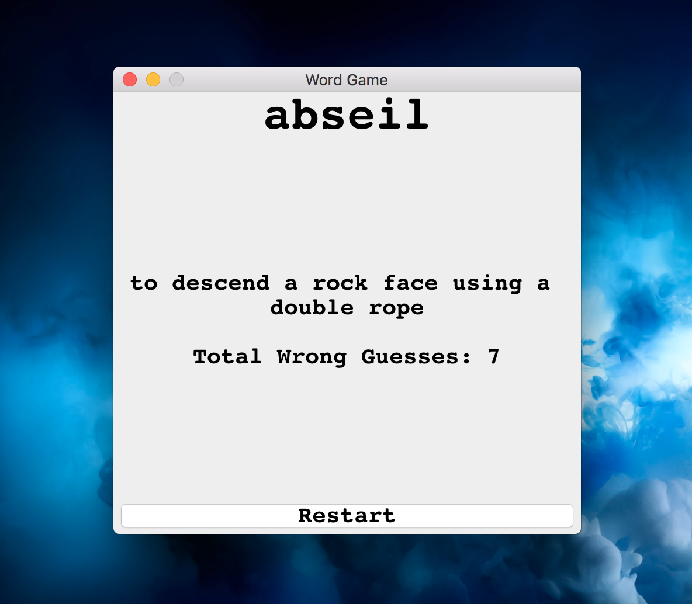
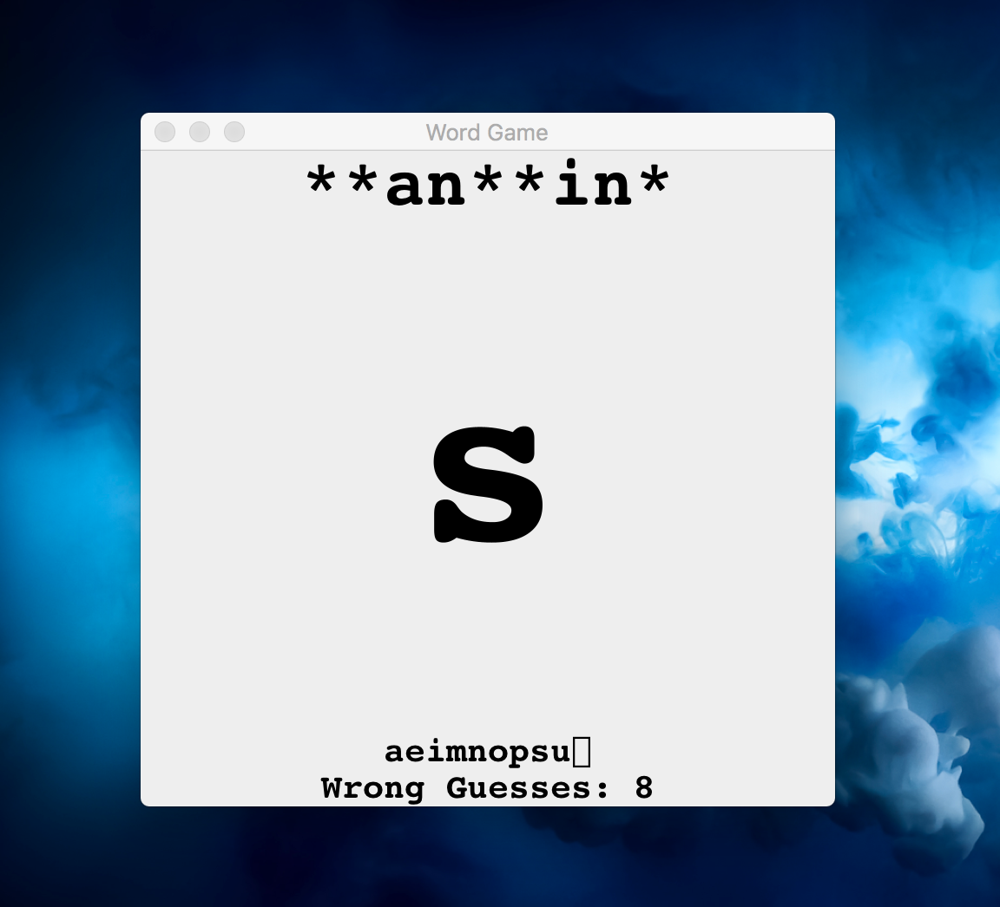
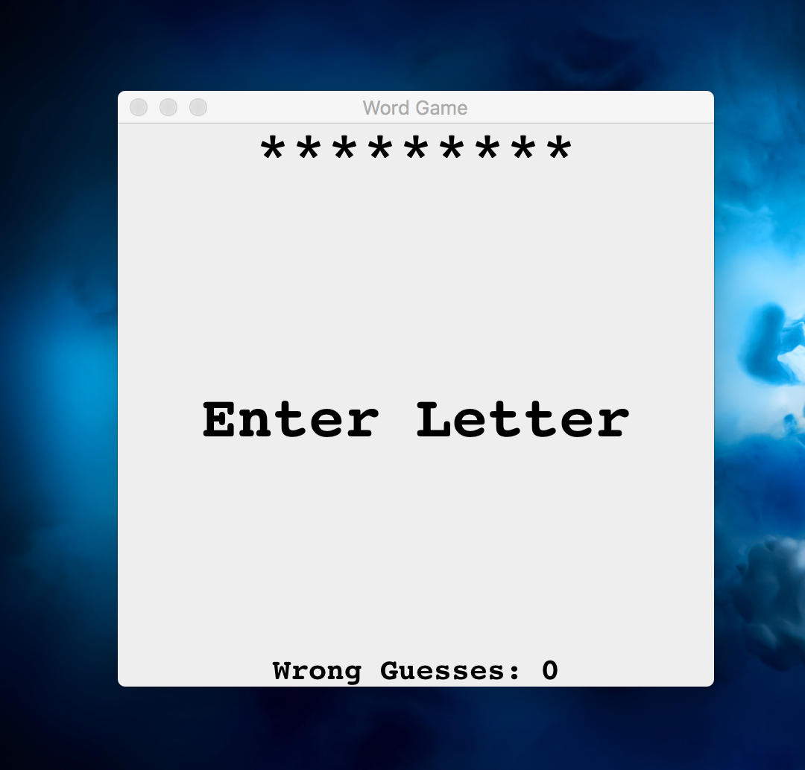

# Guess Word Game

Window pop up game. Enter letters until the word is complete whilst trying to keep the total guesses low. Points are added for every wrong guess.

To keep the game fresh I scrape the word used and also the meaning from a website using JSoup to grab the text from the relevant elements.

Once the whole word is revealed so is its meaning.

I had fun writing this one and learning new things about Java, but it could do with refactoring which I'll look into at another time :)

## Installation

```
git clone git@github.com:LondonJim/guess-word-game.git
```

## Instructions
#### Build .jar file

```
gradle build
```

#### Execute
```
java -jar ./build/libs/guess.jar
```

## Tests
`JUnit 4.12`

```
gradle test
```

## User Stories

```
As a player,
So I don't have the same words every game,
I want a random word every game

As a player,
So I know how many letters are in a word,
I want the letters of the word displayed as underscores

As a player,
So I can guess the word,
I want to be able to enter a letter

As a player,
So I know how well I'm doing,
I want the correct letters revealed

As a player,
So I do not repeat a letter,
I want the list of past guesses displayed

As a player,
So there is an end to the game,
I want a message on guessing the whole word

As a player,
So I can know more about the word,
I want the meaning of the word revealed

As a player,
So I can play again
I want a restart button
```

## Screen Shots




